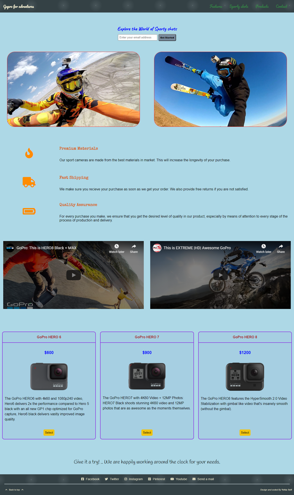

# Product landing page

## Project 2 - Landing Page (Front End Developer Udacity Nanodegree)

### created with HTML, CSS, Javascript (Vanilla)

### Project Description
The product landing page created as part of my FEND Nanodegree course.
The task was to build a multi section landing page with dynamically built navigation and 'highlighted' sections - for user to see what section he is actively viewing. In addition the navigation items when clicked smoothly scroll to the corresponding section.

### Building
I followed the following steps: 

1. Setting up the environment
1. Building out my HTML with at least three content sections
1. Building the navigation menu
1. Adding functionality to distinguish the section in view
1. Adding functionality to scroll to sections
1. Refactoring and testing the performance

### Result (Homepage)

